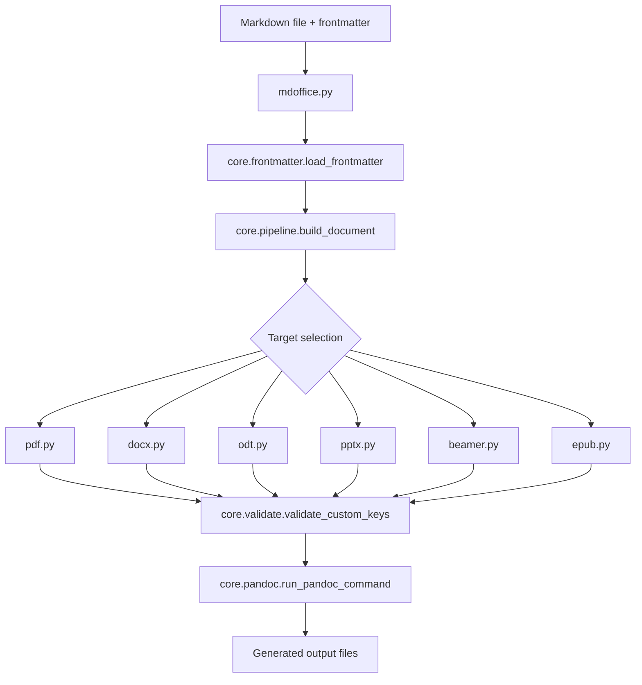

# mdOffice

Homepage: https://magnussimonsen.github.io/mdOffice/

mdOffice lets you write in plain Markdown and automatically generate PDF, DOCX, ODT, PPTX, Beamer slides, and EPUB into separate output folders just by saving the file. Output is controlled by a short YAML frontmatter block at the top of each Markdown file.

See [`_core/examples/`](_core/examples/) for ready-to-use example files.

**Example Markdown file:**

````markdown
---
title: "My Document"  # optional
author: "Your Name"   # optional
date: "2026-06-22"    # optional
fontsize: 11pt        # optional

mdoffice:
  make-pdf: true          # build a PDF when the file is saved
  make-docx: false        # set to true to also build a Word document (optional, all make-* flags are false by default)
  page-numbering: true    # show page numbers, optional
  show-solution: false    # hide solution blocks in output, optional
  show-blankbox: true     # render ::: blankbox ::: blocks as empty answer boxes, optional
---

# Some example text


This is some inline math: $x + 2$

LaTeX math environments can be written with or without enclosing dollar signs.
The dollar signs below are optional:

$$
\begin{align*}
x &= x + 2 \\
y &= y - 3
\end{align*}
$$

For tests and quizzes, questions and hidden solutions can live in the same file.
Set `mdoffice.show-solution: true` in the frontmatter to reveal the solution box in the output.

**Question:** What is $x + 2$ when $x = 3$?

::: solution
$$x + 2 = 3 + 2 = 5$$
:::

With `mdoffice.show-blankbox: true`, an empty box for handwritten answers is
printed where a `blankbox` block appears (the number is the height in lines):

::: blankbox
5
:::
````

Pandoc's own built-in keys (`title`, `author`, `fontsize`, `logo`, ...) stay at the **top level** of the frontmatter, exactly where pandoc expects them. Everything mdOffice invented itself (`make-pdf`, `doc-style`, `show-solution`, ...) lives nested under one `mdoffice:` map. See [`_core/doc/frontmatter-reference.md`](_core/doc/frontmatter-reference.md) for the full list and which top-level keys mdOffice also reads.

## Requirements

mdOffice is a thin Python wrapper around Pandoc; Pandoc (and, for PDF/Beamer, a LaTeX distribution) does the actual document conversion, so both need to be installed and on `PATH` separately from the Python setup below.

| Requirement | Needed for | Notes |
|---|---|---|
| [Pandoc](https://pandoc.org/installing.html) | every target | Built/tested against Pandoc 3.x |
| A LaTeX distribution providing `xelatex` | PDF, Beamer only | MiKTeX (Windows), TeX Live (Linux), or MacTeX (macOS) — see Step 1 below |
| Python 3 | running `mdoffice.py` itself | Version pinned in [`.python-version`](.python-version) (currently 3.13) |
| [`pyyaml`](https://pypi.org/project/PyYAML/) | frontmatter parsing | Installed via `_core/scripts/requirements.txt` in Step 3 |
| VS Code *(recommended, not required)* | the "build on save" workflow | See [`_core/vscode-settings-templates/extensions.json`](_core/vscode-settings-templates/extensions.json) |

VS Code extensions, if you use it:

| Extension | Role |
|---|---|
| [ms-python.python](https://marketplace.visualstudio.com/items?itemName=ms-python.python) | Points VS Code at the `.venv` interpreter |
| [emeraldwalk.runonsave](https://marketplace.visualstudio.com/items?itemName=emeraldwalk.runonsave) | **Required** for the "save the .md file, get a PDF/DOCX/..." workflow — runs `mdoffice.py build-all` on save |
| [fabiospampinato.vscode-highlight](https://marketplace.visualstudio.com/items?itemName=fabiospampinato.vscode-highlight) | Optional: highlights `:::solution`/`:::blankbox` blocks and LaTeX math environments in the editor |

Docx/ODT/PPTX/EPUB output only need Pandoc — skip the LaTeX install if you never build PDF or Beamer.

## Getting Started

Follow these steps once when you set up mdOffice on a new machine.

*If any of the steps below fail, copy and paste this README into an AI and troubleshoot. A common cause of failure is that your Python alias is something different than what is used here.*

---

### Step 1: Install Pandoc and a LaTeX distribution

**Windows**

```powershell
winget install --id JohnMacFarlane.Pandoc
```

Then install [MiKTeX](https://miktex.org/download) for `xelatex`. On the first PDF build, MiKTeX prompts to install missing packages one at a time — accept those prompts, or open the MiKTeX Console once and enable "Always install missing packages on-the-fly" to skip future prompts.

**Linux**

```bash
sudo apt install pandoc texlive-xetex texlive-latex-extra texlive-fonts-extra
```

(Substitute `texlive-full` instead of the three `texlive-*` packages above if you'd rather not track down individual package names later, at the cost of a much larger download.)

**macOS**

```bash
brew install pandoc
```

Then install [MacTeX](https://tug.org/mactex/) for `xelatex`.

**Verify both are on `PATH`:**

```bash
pandoc --version
xelatex --version
```

---

### Step 2: Check that Python is installed

Open a terminal and run:

**Windows (PowerShell)**

```powershell
python --version
```

**Linux / macOS**

```bash
python3 --version
```

If neither prints a Python 3 version, install Python from [python.org](https://www.python.org/downloads/) before continuing. The recommended version for this repo is listed in `.python-version`. `requirements.txt` can install Python packages, but it cannot install Python itself.

---

### Step 3: Create the virtual environment

The workspace expects a `.venv` folder at the root of the repo. Create it with the Python version from Step 2.

**Step 3: Windows (PowerShell)**

```powershell
py -3.13 -m venv .venv
.\.venv\Scripts\Activate.ps1
python -m pip install -r _core/scripts/requirements.txt
```

If `py -3.13` is not available but Python 3.13 is installed, use the full path:

```powershell
& "C:\Path\To\Python313\python.exe" -m venv .venv
.\.venv\Scripts\python.exe -m pip install -r _core/scripts/requirements.txt
```

**Step 3: Linux / macOS**

```bash
python3.13 -m venv .venv
./.venv/bin/python -m pip install -r _core/scripts/requirements.txt
```

If `python3.13` is not available, substitute the installed interpreter name, e.g. `python3`.

---

### Step 4: Configure VS Code settings by making a new file named "settings.json" in the .vscode folder

[`_core/vscode-settings-templates/`](_core/vscode-settings-templates/) has ready-to-paste templates:

| File | Use for |
|---|---|
| `settings.windows.json` | Run on Save + Python interpreter path, Windows |
| `settings.linux.json` | Run on Save + Python interpreter path, Linux / macOS |
| `settings.windows_with_highlights.json` | Same as `settings.windows.json`, plus editor highlighting for `:::solution`/`:::blankbox` blocks and LaTeX math environments (needs the [Highlight](https://marketplace.visualstudio.com/items?itemName=fabiospampinato.vscode-highlight) extension) |
| `settings.linux_with_highlights.json` | Same as `settings.linux.json`, plus the highlighting above |
| `vscode-highlight.json` | Just the `highlight.regexes` key on its own, for merging into a `settings.json` you're customizing by hand |
| `extensions.json` | Recommended extensions for this workspace |

Pick the template matching your OS (add `_with_highlights` if you want the editor highlighting) and copy it to `.vscode/settings.json` — this creates the file if it doesn't exist yet.

**Step 4: Windows (PowerShell)**

```powershell
copy _core\vscode-settings-templates\settings.windows_with_highlights.json .vscode\settings.json
```

**Step 4: Linux / macOS**

```bash
cp _core/vscode-settings-templates/settings.linux_with_highlights.json .vscode/settings.json
```

---

After these four steps VS Code will use `.venv` as the Python interpreter and Run on Save will trigger the mdOffice build pipeline automatically when you save a Markdown file.

---

### Troubleshooting: save triggers no PDF (or Run on Save fails silently)

**`[WinError 2] Systemet finner ikke angitt fil` / "cannot find the file specified" for pandoc**
Pandoc auto-updates itself (e.g. via winget) into a new version-numbered install folder, but a terminal or VS Code window opened *before* that update keeps the old, now-deleted path cached in its environment. Fully restart VS Code (not just open a new terminal tab) so it re-reads `PATH`, then save the file again.

**`fontspec Error: The font "..." cannot be found`**
Any `mainfont` (or other font) set in a document's frontmatter must be a font actually installed on the machine running the build — pandoc/xelatex does not bundle fonts. Fonts like "Liberation Serif" are common on Linux but usually missing on Windows; install the font family (e.g. the [Liberation Fonts](https://github.com/liberationfonts/liberation-fonts) release) or change `mainfont` in the frontmatter to a font you already have (e.g. "Times New Roman").

---

The rest of this README has two goals:

1. Point you to the frontmatter reference for PDF, DOCX, ODT, PPTX, Beamer, and EPUB.
2. Give developers a quick overview of how the conversion pipeline works in code.

## 1) Frontmatter Options (All Targets)

For the full, always-current list of frontmatter options (global toggles, and each target's custom `mdoffice:` keys plus the top-level pandoc keys mdOffice also reads), see
[`_core/doc/frontmatter-reference.md`](_core/doc/frontmatter-reference.md). It's generated directly from the code (`python _core/scripts/mdoffice.py docs`), so it never drifts from what the schemas actually declare.

You can also check a single document's frontmatter against the schema without building anything:

```bash
python _core/scripts/mdoffice.py validate path/to/file.md
```

## 2) Custom themes (LaTeX headers)

PDF and Beamer output can be customized by pointing at a LaTeX file in
[`_core/scripts/themes/`](_core/scripts/themes/):

- `mdoffice.doc-style` (PDF, default `standard-pdf`) loads `themes/<doc-style>.tex`
- `mdoffice.beamer-style` (Beamer, no default — pandoc's plain beamer theme is used if unset) loads `themes/<beamer-style>.tex`

The file is included as a pandoc header (`--include-in-header`), so it can
redefine fonts, colors, title formatting, `\geometry{...}`, etc. Available
themes today: `standard-pdf.tex`, `exam.tex`, `beamer.tex`, `fancybeamer.tex`. Add your own
`.tex` file to that folder and reference its name (without `.tex`) from
`mdoffice.doc-style` or `mdoffice.beamer-style` in your document's frontmatter.

## 3) Display math and the math_env_normalize.lua filter

Wrap LaTeX math environments (`align`, `equation`, `gather`, `multline`, `cases`, ...) in `$$ ... $$` rather than leaving them bare — pandoc needs the `$$` to recognize the block as math at all. [`_core/scripts/filters/math_env_normalize.lua`](_core/scripts/filters/math_env_normalize.lua) then strips the redundant `$$` wrapper back out for PDF/Beamer output, so the final LaTeX doesn't end up with nested math delimiters around, say, an `align` block.

## 4) Regex filters in settings.json

[`_core/vscode-settings-templates/vscode-highlight.json`](_core/vscode-settings-templates/vscode-highlight.json) has regex filters (for the [Highlight](https://marketplace.visualstudio.com/items?itemName=fabiospampinato.vscode-highlight) extension) that highlight `:::solution`/`:::blankbox` blocks and LaTeX environment keywords directly in the editor.

The goal is to make it easier to read and edit math-heavy markdown files.

## 5) Developer Pipeline Map

This README is the main overview for the current mdOffice v2 pipeline.



The pipeline is intentionally split into small modules so each part has one job.

The mdOffice v2 flow is intentionally split into small modules:

- CLI entrypoint: `_core/scripts/mdoffice.py`
- Pipeline orchestration: `_core/scripts/core/pipeline.py`
- Frontmatter loading/helpers (`load_frontmatter`, `get_custom`, `get_flag`, `get_value`): `_core/scripts/core/frontmatter.py`
- Schema declarations (the `mdoffice:`-vs-pandoc-vocabulary split, per target): `_core/scripts/core/schema.py`
- Unknown-key warnings against those schemas: `_core/scripts/core/validate.py`
- Asset/theme path resolution: `_core/scripts/core/assets.py`
- TeX escaping/sanitization for user-supplied text, lengths, colors, and paths: `_core/scripts/core/tex_sanitize.py`
- Accumulating `\def` macros into one `--include-in-header` file per PDF/Beamer build: `_core/scripts/core/latex_defs.py`
- Lua filter wiring for PDF/Beamer: `_core/scripts/core/filters.py`
- Pandoc execution/cleanup: `_core/scripts/core/pandoc.py`
- Planner registry (`PLANNERS`, `SCHEMAS`): `_core/scripts/formats/__init__.py`
- Format planners (each declares its own `SCHEMA` and a `create_plan(...)` function):
	- `_core/scripts/formats/pdf.py`
	- `_core/scripts/formats/docx.py`
	- `_core/scripts/formats/odt.py`
	- `_core/scripts/formats/pptx.py`
	- `_core/scripts/formats/beamer.py`
	- `_core/scripts/formats/epub.py`

### High-level Execution

```text
mdoffice.py
	-> parse CLI args
	-> choose command: build-all, build, validate, get-ai-instructions, build-ai-instructions, or docs
	-> (build-all / build) call core.pipeline.build_document(...)
			 -> load_frontmatter(...)
			 -> choose targets
			 -> for each target:
						planner = PLANNERS[target]
						warn on unrecognized mdoffice.* keys via SCHEMAS[target]
						plan = planner(md_file, config, scripts_dir)
						run_pandoc_command(plan.command, md_file, plan.temp_files)
						validate output file exists
						append result
			 -> return BuildReport
	-> print per-target status + final exit code
```

### Command Modes

- `build-all <file.md>`
	- Reads frontmatter toggles: `mdoffice.make-pdf`, `mdoffice.make-docx`, `mdoffice.make-pptx`, `mdoffice.make-beamer`, `mdoffice.make-epub`.
	- Builds only enabled targets.

- `build <file.md> --targets pdf,docx,...`
	- Ignores enable toggles.
	- Builds exactly the requested targets.

- `validate <file.md>`
	- Prints any `mdoffice.*` keys not recognized by the schemas for that file's enabled targets, without building anything.

- `get-ai-instructions <file.md>` / `build-ai-instructions <file.md>`
	- Read `mdoffice.ai-instructions` from frontmatter and either print the combined content, or write pointer files (`CLAUDE.md`, `.continuerules`) next to the document.

- `docs`
	- Regenerates [`_core/doc/frontmatter-reference.md`](_core/doc/frontmatter-reference.md) from the format schemas.

### Planner Responsibilities

Each planner should do only this:

- Declare its `SCHEMA` (which `mdoffice:` keys it owns, and which top-level pandoc keys it also intercepts).
- Decide output folder and output filename.
- Build pandoc command arguments for that target.
- Add target-specific defaults when a frontmatter value is missing.
- Return `TargetPlan`.

The pipeline handles the rest (looping targets, warning on unknown keys, invoking pandoc, collecting results).

### Runtime Behavior

- Pandoc runs in the markdown file's directory.
- Temporary files a planner creates (e.g. the accumulated `_mdoffice_defs.tex`) are cleaned up after the run, success or failure.
- Target result is marked failed if pandoc exits non-zero.
- Target result is also marked failed if the expected output file was not created.

### Data Model (`core/models.py`)

- `TargetPlan`: planned command and expected output
- `TargetResult`: one target execution result
- `BuildReport`: all target results for one source file

### Quick Dev Checks

```bash
python _core/scripts/mdoffice.py build-all _core/examples/pptx.md
python _core/scripts/mdoffice.py build _core/examples/mathtest.md --targets pdf,docx
python _core/scripts/mdoffice.py build _core/examples/beamer.md --targets beamer
```

If you add a new format, register its `create_plan` and `SCHEMA` in `formats/__init__.py` (`PLANNERS` and `SCHEMAS`) and add it to `SUPPORTED_TARGETS` in `core/pipeline.py`.
