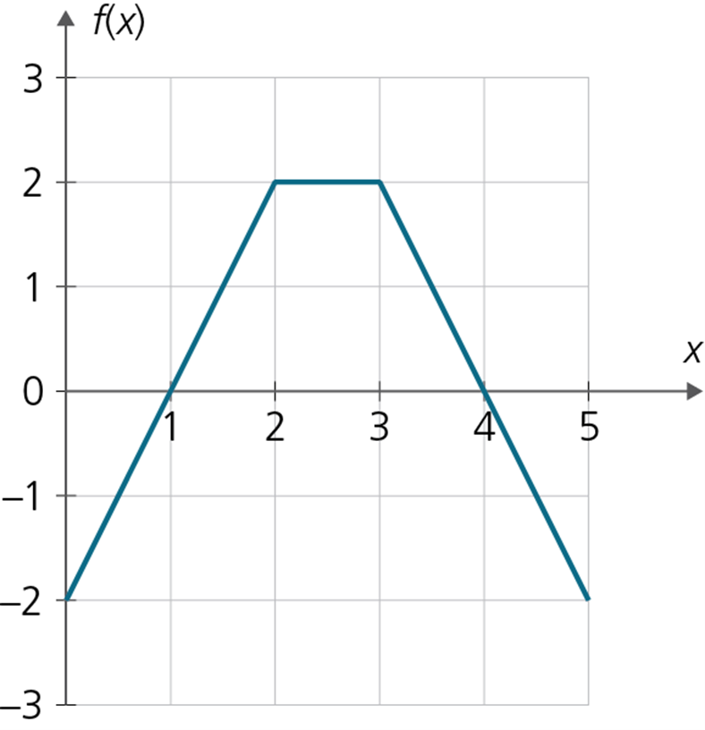
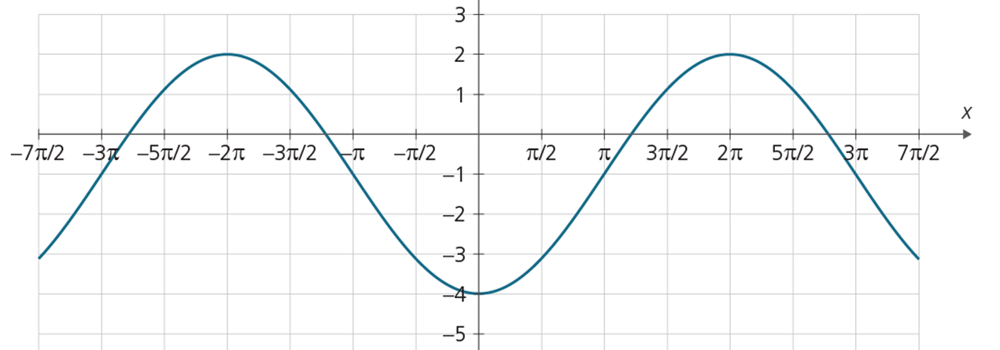
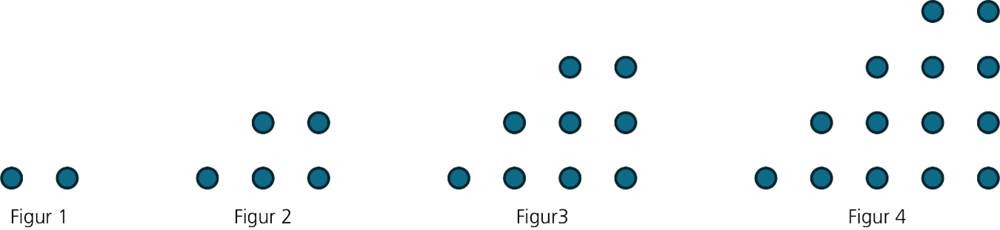

Allowed aids: Calculator, writing materials, and formula sheet.

## Task 1
Compute the integrals.

**a)** $\displaystyle\int\limits_0^\pi x \cos x \, dx$

::: blankbox
10
:::

::: solution
Integration by parts with $u = x$, $v' = \cos x$:

\begin{align}
\int\limits_0^\pi x \cos x \, dx &= [x \sin x]_0^\pi - \int\limits_0^\pi \sin x \, dx \\
&= 0 - [-\cos x]_0^\pi \\
&= -(-\cos\pi + \cos 0) \\
&= -(1 + 1) = -2
\end{align}
:::

**b)** $\displaystyle\int \frac{1}{x^2+x} \, dx$

::: {.blankbox lines=10}
:::

::: solution
Partial fraction decomposition, $x^2 + x = x(x+1)$:

$$
\frac{1}{x(x+1)} = \frac{1}{x} - \frac{1}{x+1}
$$

$$
\int \frac{1}{x} - \frac{1}{x+1} \, dx = \ln|x| - \ln|x+1| + C
$$
:::

## Task 2

Determine $t$ such that

$$
\int\limits_1^t \frac{1}{x+1} \, dx = \ln\left(\frac{5}{2}\right) 
$$

::: solution
Integrate the left-hand side using the substitution $u = x+1$, $u' = 1$:

$$
\begin{align}
\int\limits_1^t \frac{1}{x+1} \, dx &= \int\limits_1^t \frac{1}{u}\frac{1}{u'} du \\ 
&= \int\limits_1^t \frac{1}{u} du \\
&=\left[\ln|u|\right]_1^t \\
&=\left[\ln|x+1|\right]_1^t \\
&= \ln(t+1) - \ln 2
\end{align}
$$

Set this equal to the right-hand side and solve for $t$:

\begin{align}
\ln(t+1) - \ln 2 &= \ln\!\left(\frac{5}{2}\right) \\
\ln(t+1) &= \ln\!\left(\frac{5}{2}\right) + \ln 2 = \ln\!\left(\frac{5}{2} \cdot 2\right) = \ln 5 \\
t+1 &= 5 \\
t &= 4
\end{align}
:::

## Task 3

The functions $f$ and $g$ are given by $f(x)=4-x^2$ and $g(x)=x+2$.
The graphs of $f$ and $g$ bound a region. What is the area of this region?

::: solution
You should also sketch the graphs in a coordinate system for $x\in \left[-2,2\right]$.

Find the intersection points:

\begin{align}
f(x)&=g(x)\\
4-x^2&=x+2\\
0&=x^2+x-2\\
 &=(x-1)(x+2)
\end{align}

The graphs intersect at $x=-2$ and $x=1$.

The area is given by the integral

$$
\begin{align}
\int\limits_{-2}^1\left(f(x)-g(x)\right)dx
&=\int\limits_{-2}^1\left(2-x-x^2\right) dx\\
&=\left[2x - \frac{x^2}{2} - \frac{x^3}{3}\right]_{-2}^1\\
&=\left(2 - \frac{1}{2} - \frac{1}{3}\right)-\left(-4 - 2 + \frac{8}{3}\right)\\
&=\frac{7}{6}-\left(-6+\frac{8}{3}\right)\\
&=\frac{7}{6}+6-\frac{8}{3}\\
&=\frac{7}{6}+\frac{36}{6}-\frac{16}{6}\\
&=\frac{27}{6}\\
&=\frac{9}{2}
\end{align}
$$
:::

## Task 4

The sum of the first ten terms of an arithmetic sequence is 90.

Determine the common difference $d$, given that $a_1=3$.

::: solution
The sum of the first $n$ terms of an arithmetic sequence is
$$
S_n = \frac{n}{2}(2a_1 + (n-1)d)
$$
Here, $S_{10} = 90$, $a_1 = 3$, $n = 10$.

Substitute into the formula:

\begin{align}
90 &= \frac{10}{2}(2 \cdot 3 + 9d) \\
90 &= 5(6 + 9d) \\
90 &= 30 + 45d \\
60 &= 45d \\
d &= \frac{60}{45} = \frac{4}{3}
\end{align}
:::

## Task 5

The points $A(1, 2, 0)$, $B(4, 6, 2)$, and $C(8, 6, 4)$ are given.

**a)** Determine the area of $\triangle ABC$.

::: solution
Find the vectors:
$$\vec{AB} = [3,4,2], \qquad \vec{AC} = [7,4,4]$$

The area of $\triangle ABC = \frac{1}{2}|\vec{AB}\times\vec{AC}|$:

$$
\begin{align}
\vec{AB}\times\vec{AC}
  &= \begin{vmatrix}\vec{e}_x&\vec{e}_y&\vec{e}_z\\3&4&2\\7&4&4\end{vmatrix} \\
  &= [4\cdot4-2\cdot4,\ 2\cdot7-3\cdot4,\ 3\cdot4-4\cdot7] \\
  &= [8,\ 2,\ -16]
\end{align}
$$

\begin{align}
|\vec{AB}\times\vec{AC}|
  &= \sqrt{8^2+2^2+16^2} \\
  &= \sqrt{324} = 18
\end{align}

$$
\text{Area} = \tfrac{1}{2}\cdot 18 = 9
$$
:::

**b)** Find the distance from point $C$ to the line through $A$ and $B$.

::: solution
Use the relationship between area, base length, and height:

$$
\begin{align}
\text{Area} &= \tfrac{1}{2}\cdot|\vec{AB}|\cdot d \\
d &= \frac{2\cdot\text{Area}}{|\vec{AB}|}
\end{align}
$$

$$
|\vec{AB}| = \sqrt{3^2+4^2+2^2} = \sqrt{29}
$$

\begin{align}
  d &= \frac{18}{\sqrt{29}} = \frac{18\sqrt{29}}{29}
\end{align}
:::

## Task 6

Given the planes $\alpha: x+y+z=6$ and $\beta: 2x-y+z=3$.

Find a parametric equation for the line of intersection between the two planes.

::: solution
The normal vectors of the planes are $\vec{n_{\alpha}}=[1,1,1]$ and $\vec{n_{\beta}}=[2,-1,1]$.

The direction vector of the line is $\vec{r} = \vec{n_{\alpha}}\times\vec{n_{\beta}}$:

$$
\begin{align}
\vec{n_{\alpha}}\times\vec{n_{\beta}}
  &= \begin{vmatrix}\vec{e}_x&\vec{e}_y&\vec{e}_z\\1&1&1\\2&-1&1\end{vmatrix} \\
  &= [1\cdot1-1\cdot(-1),\ 1\cdot2-1\cdot1,\ 1\cdot(-1)-1\cdot2] \\
  &= [2,\ 1,\ -3]
\end{align}
$$

Find one point on the line by setting $z=0$:

\begin{align}
x + y &= 6 \\
2x - y &= 3
\end{align}

Add the equations: $3x=9 \implies x=3$, $y=3$.

Parametric equation of the line of intersection:
$$
\ell\colon [3,\, 3,\, 0] + t[2,\, 1,\, -3], \quad t\in\mathbb{R}
$$
:::

## Task 7

The figure below shows the graph of the function $f$.

The function $g$ is given by $g(x) =\displaystyle\int\limits_0^x f(t) \, dt$.

Determine $g(4)$ and $g'(4)$.

::: solution

\begin{align}
g(4) &= \frac{1}{2}\cdot 1\cdot (-2)+ \frac{(1+ 4)\cdot 2}{2}\\
     &=  -1+5\\
     &=4
\end{align}

Use the Fundamental Theorem of Calculus to find $g'(4)$.

\begin{align}
g'(4) &= f(4)\\
      &=0
\end{align}

:::

## Task 8

An angle $\theta$ in the second quadrant is given by $\sin \theta = \dfrac{3}{5}$.

**a)** Determine $\cos\theta$ and $\tan\theta$.

::: solution
Use $\sin^2\theta + \cos^2\theta = 1$:

\begin{align}
\cos^2\theta &= 1 - \sin^2\theta = 1 - \frac{9}{25} = \frac{16}{25}
\end{align}

In the second quadrant, $\cos\theta < 0$, so $\cos\theta = -\dfrac{4}{5}$.

$$
\tan\theta = \frac{\sin\theta}{\cos\theta} = \frac{3/5}{-4/5} = -\frac{3}{4}
$$
:::

**b)** Solve the equation $2\cos(2x)=1$ for $x\in\left[0, 2\pi\right]$.

::: solution
$2\cos(2x)=1 \implies \cos(2x)=\dfrac{1}{2}$

Let $u=2x$, then $u\in[0,4\pi]$ and we solve $\cos u = \dfrac{1}{2}$:

$$
\begin{align}
u &= \frac{\pi}{3} + 2k\pi \quad \text{or} \quad u = -\frac{\pi}{3} + 2k\pi, \quad k\in\mathbb{Z}
\end{align}
$$

For $u\in[0,4\pi]$:

$$
u = \frac{\pi}{3},\quad \frac{5\pi}{3},\quad \frac{7\pi}{3},\quad \frac{11\pi}{3}
$$

Back to $x = \dfrac{u}{2}$:

$$
x = \frac{\pi}{6},\quad \frac{5\pi}{6},\quad \frac{7\pi}{6},\quad \frac{11\pi}{6}
$$
:::

The figure below shows the graph of a function $f$.

**c)** Find an expression for $f$.

::: solution
Period:  $p  = 4\pi$.\
Amplitude: $A = 3$.\
Midline: $d=-1$.\
Angular frequency: $c=\frac{2\pi}{p}=\frac{2\pi}{4\pi}=\frac{1}{2}$\
To find the phase angle, first observe where the graph crosses the midline while increasing. This happens, for example, at $x=x_0=\pi$.

Then $cx_0+\phi=0$, which gives $\phi=-cx_0=-\dfrac{\pi}{2}$.

The harmonic oscillation is:
$$f(x)=3\sin\!\left(\frac{1}{2}x-\frac{\pi}{2}\right)-1$$
:::

\newpage
## Task 9

Each figure below consists of dots arranged in a specific pattern.

Let $F_n$ be the number of dots in figure $n$. The first four figure numbers are 2, 5, 9, and 14.

**a)** Determine $F_6$.

::: solution
$F_6=27$
:::

**b)** It can be shown that $F_n = F_{n-1}+n+1$. Carry out an induction proof showing that $F_n=\dfrac{1}{2}n^2+\dfrac{3}{2}n$ for all $n\geq 1$.

::: solution
We will show that $F_n = \dfrac{1}{2}n^2 + \dfrac{3}{2}n$ for all $n \geq 1$.

**Base case** ($n=1$):
$$F_1 = \frac{1}{2}\cdot 1^2 + \frac{3}{2}\cdot 1 = \frac{1}{2} + \frac{3}{2} = 2 \checkmark$$

**Induction step:** Assume that $F_k = \dfrac{1}{2}k^2 + \dfrac{3}{2}k$ for an arbitrary $k \geq 1$ (the induction hypothesis).

We must show that $F_{k+1} = \dfrac{1}{2}(k+1)^2 + \dfrac{3}{2}(k+1)$.

From the recursive relation $F_n = F_{n-1} + n + 1$, we get:

$$F_{k+1} = F_k + (k+1) + 1 = F_k + k + 2$$

Substitute the induction hypothesis:

\begin{align}
F_{k+1} &= \frac{1}{2}k^2 + \frac{3}{2}k + k + 2 \\
        &= \frac{1}{2}k^2 + \frac{5}{2}k + 2
\end{align}

Check that the formula gives the same value for $n = k+1$:

\begin{align}
\frac{1}{2}(k+1)^2 + \frac{3}{2}(k+1)
  &= \frac{1}{2}(k^2+2k+1) + \frac{3}{2}k + \frac{3}{2} \\
  &= \frac{1}{2}k^2 + k + \frac{1}{2} + \frac{3}{2}k + \frac{3}{2} \\
  &= \frac{1}{2}k^2 + \frac{5}{2}k + 2 \checkmark
\end{align}

The formula is proven for all $n \geq 1$.
:::

## Task 10

Aisha is saving for a down payment to buy a home. On the 1st of each month, she transfers NOK 12,000 to a savings account with 0.3% monthly interest. The first transfer was on 1 January 2023.

**a)** Explain why the very first deposit has been in the account for 36 months by the end of December 2025.

::: solution
From 1 January 2023 to 31 December 2025 is exactly 3 years $= 3 \times 12 = 36$ months.
The first deposit was made on 1 January 2023 and has therefore been in the account for 36 months by the end of December 2025.
:::

**b)** How much does she have in the account by the end of December 2025?

::: solution
Deposit number $j$ (counted from the end) has been in the account for $j$ months and has grown to $12\,000 \cdot 1{,}003^j$.

The sum of all 36 deposits is a geometric series with $a_1 = 12\,000 \cdot 1{,}003$, ratio $k = 1{,}003$, and $n = 36$ terms:

$$
\begin{align}
S &= 12\,000\cdot1{,}003 + 12\,000\cdot1{,}003^2 + \cdots + 12\,000\cdot1{,}003^{36} \\
  &= \frac{12\,000\cdot1{,}003\cdot\left(1{,}003^{36}-1\right)}{1{,}003-1} \\
  &= \frac{12\,000\cdot1{,}003\cdot\left(1{,}003^{36}-1\right)}{0{,}003} \\
  &\approx 456\,836{,}99 \text{ NOK}
\end{align}
$$
:::

**c)** How much would she need to deposit each month for the account balance to be half a million NOK by the end of December 2025?

::: solution
Let $x$ be the monthly deposit. Then:

$$
\frac{x\cdot1{,}003\cdot\left(1{,}003^{36}-1\right)}{0{,}003} = 500\,000
$$

Solve for $x$:
$$
\begin{align}
x &= \frac{500\,000\cdot0{,}003}{1{,}003\cdot\left(1{,}003^{36}-1\right)} \\
  &\approx 13\,133{,}79 \text{ NOK}
\end{align}
$$
:::
